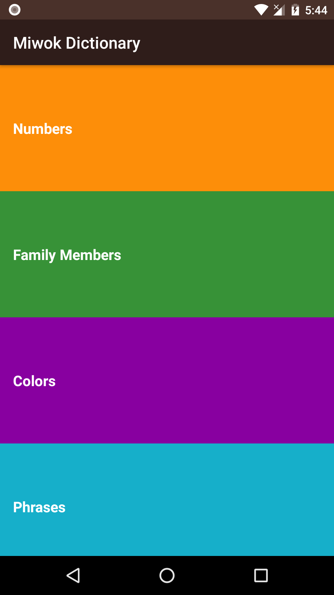
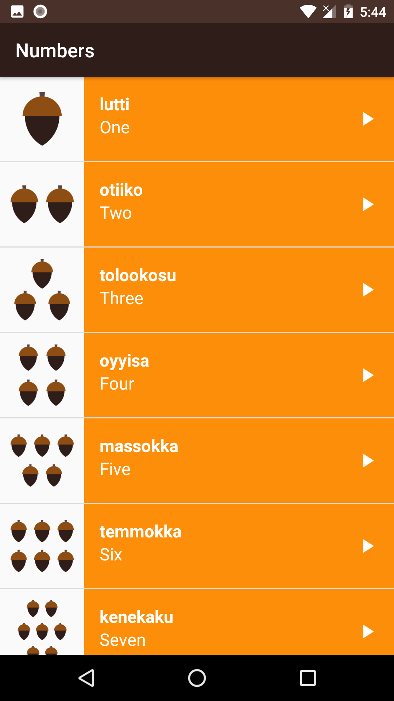
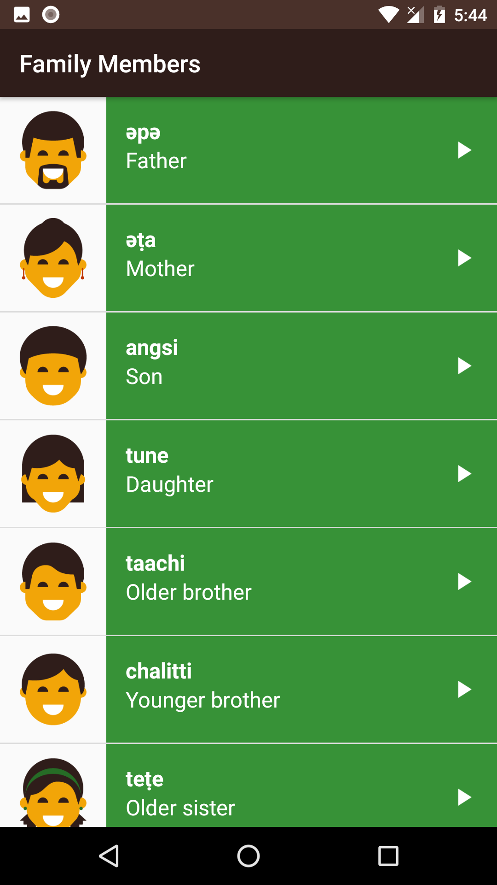
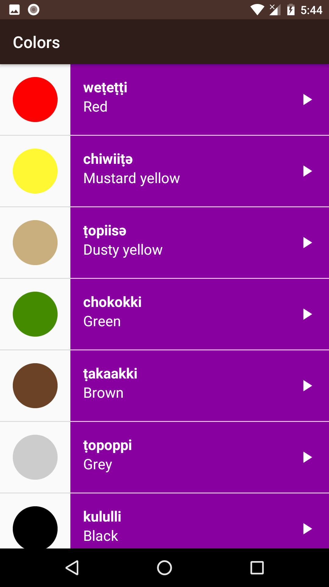
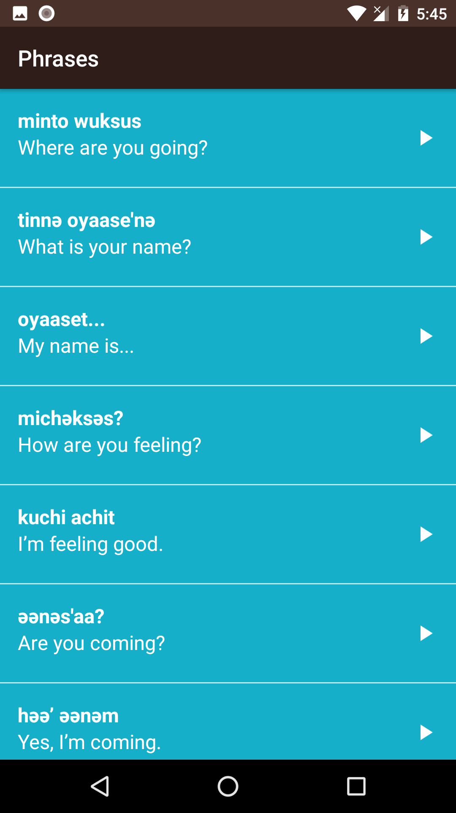

# Miwok-Dictionary
This app displays lists of vocabulary words for the user to learn the Miwok language. For every word there is an image, and for every word and phrase there is an audio file of the pronunciation. Used in a Udacity course in the Beginning Android Nanodegree.
 

 

 

 

 

